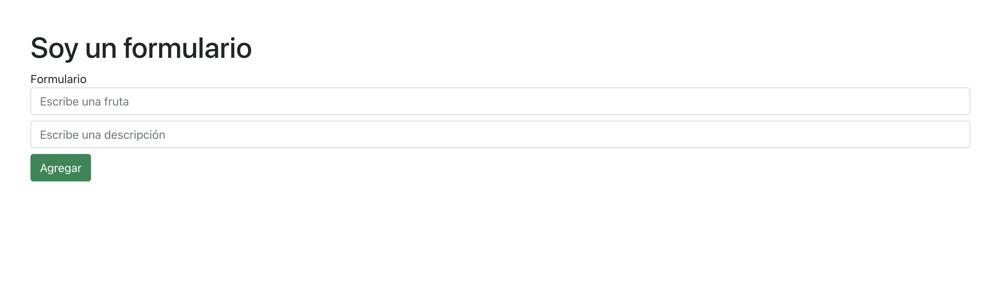
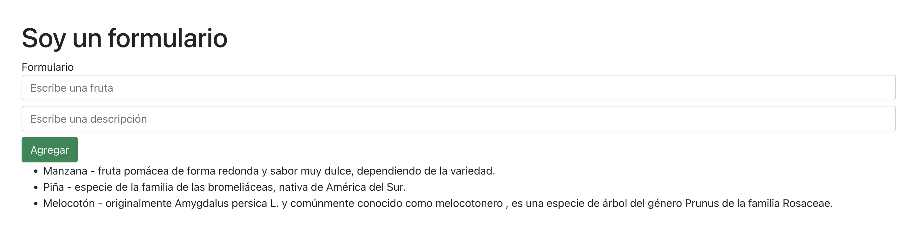

# Formularios con REACT JS

Ejercicio para practicar los fundamentos de REACT en un formulario con estados.

## Frutas y descripción

Ponemos en juego la interactividad de la librería, usando funciones y estados "Hooks"

### `Imprimiendo datos`

En cada uno de los inputs, se guardan ambos valores y se imprimen en pantalla:

Vemos en forma de listado, los datos que el usuario escribe directamente en cada input:

## Conceptos aplicados

- Hook de estado (useState)
- Listas y key
- Métodos map y trim.

[Método map](https://www.w3schools.com/jsref/jsref_map.asp)

[Método TRIM](https://www.w3schools.com/jsrEF/jsref_trim_string.asp)

- Operador de propagación
- Eventos: onClick, onChange, submit.

### `Maquetación`

[Bootstrap](https://getbootstrap.com/)

Este ejercicio ha sido realizado con el fin de poner en práctica las ventajas de REACT.
